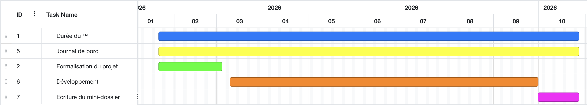

# TM 2026 Piccard

## Ressources
- [Marche à suivre VS code](./marche_a_suivre_github.md)
- [Environnement virtuel python](https://docs.python.org/fr/3/tutorial/venv.html)
- [Python Orienté Objet (slides de Mme Scarabottolo)](https://ilariaswi.github.io/TM_info_jeu_video/ressources/introduction.pdf)
- [Marche à suivre Django](https://docs.djangoproject.com/fr/6.0/intro/tutorial01/)
- [Marche à suivre Flask](https://flask-fr.readthedocs.io/quickstart/)